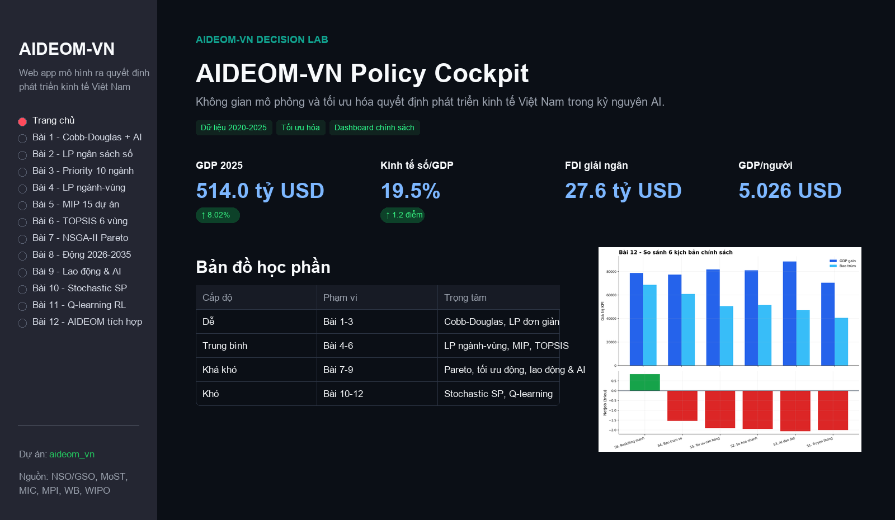
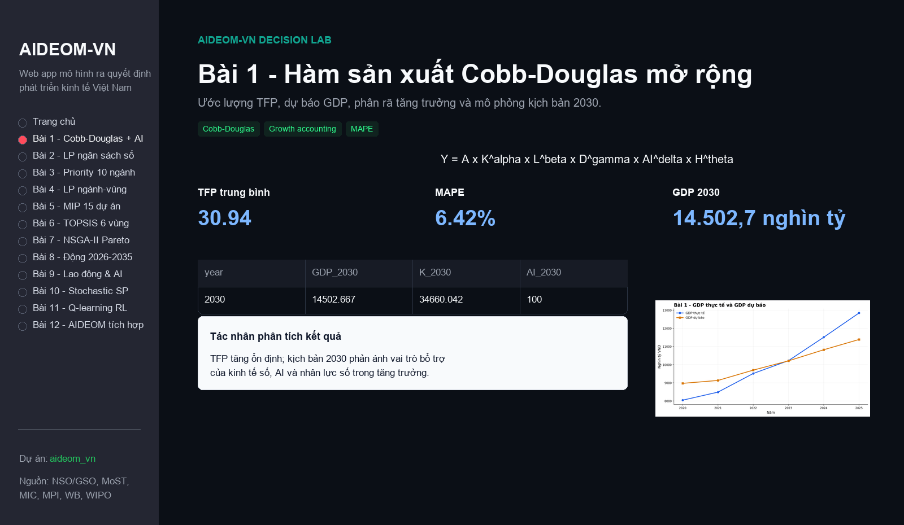
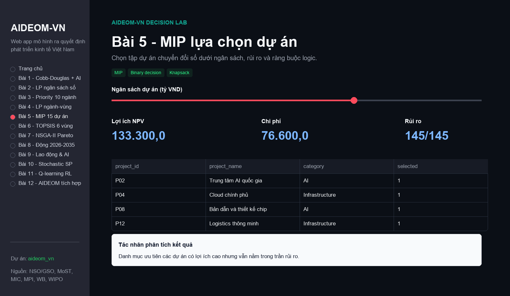
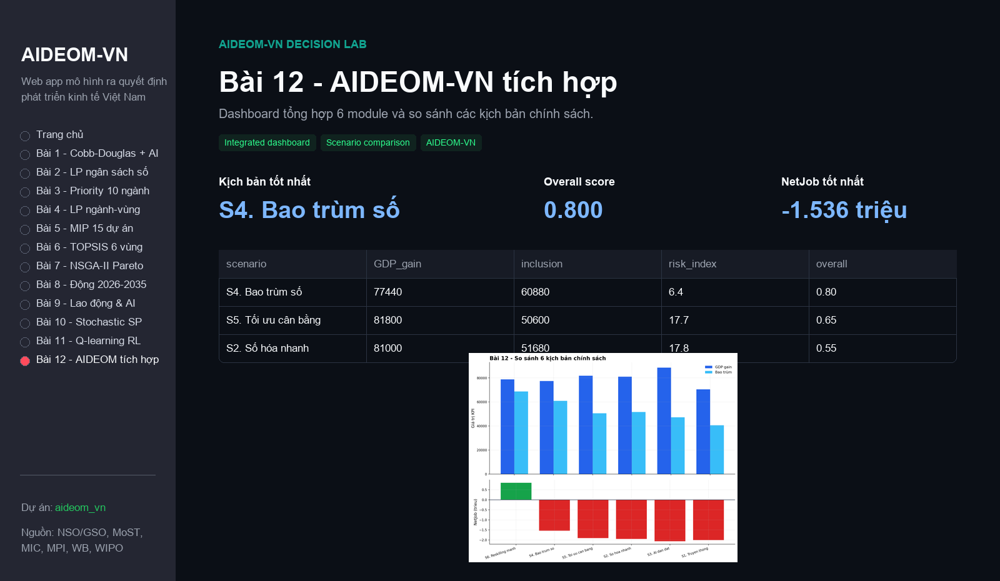

# AIDEOM-VN Decision Lab

Web app mô hình ra quyết định phát triển kinh tế Việt Nam trong bối cảnh chuyển đổi số và AI. Dự án gồm 12 bài tương ứng 12 module phân tích, tối ưu hóa, trực quan hóa và tác nhân phân tích kết quả.

## Ảnh giao diện

### Trang chủ dashboard



### Bài 1 - Cobb-Douglas mở rộng



### Bài 5 - MIP lựa chọn dự án



### Bài 12 - Dashboard tích hợp



## 1. Nội dung chính

- **Trang chủ**: tổng quan dữ liệu vĩ mô, ngành, vùng và biểu đồ chuẩn hóa 2020 = 100.
- **Bài 1**: Hàm sản xuất Cobb-Douglas mở rộng với biến kinh tế số, AI và nhân lực số.
- **Bài 2**: LP phân bổ ngân sách số, ràng buộc và shadow price.
- **Bài 3**: Chỉ số ưu tiên 10 ngành bằng chuẩn hóa và trọng số MCDM.
- **Bài 4**: LP phân bổ ngân sách theo vùng, ngành và hạng mục đầu tư.
- **Bài 5**: MIP lựa chọn danh mục 15 dự án chuyển đổi số.
- **Bài 6**: TOPSIS xếp hạng 6 vùng ưu tiên đầu tư AI.
- **Bài 7**: Tối ưu đa mục tiêu Pareto bằng NSGA-II.
- **Bài 8**: Tối ưu động giai đoạn 2026-2035.
- **Bài 9**: Mô hình tác động AI tới lao động và nhu cầu đào tạo lại.
- **Bài 10**: Quy hoạch ngẫu nhiên hai giai đoạn, VSS và EVPI.
- **Bài 11**: Q-learning cho chính sách phân bổ thích nghi.
- **Bài 12**: Dashboard tích hợp so sánh 6 kịch bản chính sách.

Mỗi bài có bảng kết quả, biểu đồ, tham số điều chỉnh và khung **Tác nhân phân tích kết quả**. Khung này đọc kết quả hiện tại của mô hình và đưa ra chẩn đoán, diễn giải chuyên gia, khuyến nghị quyết định.

## 2. Cấu trúc thư mục

```text
aideom_vn/
├── dashboard/              # Streamlit web app
├── data/                   # CSV dữ liệu đầu vào
├── notebooks/              # Ghi chú setup Colab/local
├── outputs/
│   ├── figures/            # Biểu đồ PNG phục vụ báo cáo
│   └── tables/             # Bảng kết quả CSV
├── reports/                # Tài liệu mô tả, hướng dẫn, báo cáo nháp
├── scripts/                # Script sinh output, figures và đóng gói
├── src/aideom_vn/          # Mã nguồn mô hình
├── tests/                  # Kiểm thử tự động
├── README.md
├── requirements.txt
├── run_app.bat
└── package_app.bat
```

## 3. Yêu cầu môi trường

- Python 3.10 hoặc 3.11.
- Windows, macOS hoặc Linux đều có thể chạy; bộ lệnh dưới đây viết cho Windows PowerShell.
- Các thư viện chính: Streamlit, pandas, numpy, scipy, PuLP/CBC, Pyomo/HiGHS, CVXPY, pymoo, Plotly, Kaleido.

## 4. Cài đặt và chạy web app

Mở PowerShell tại thư mục dự án:

```powershell
cd D:\Work\BaiTap\aideom_vn
```

Tạo môi trường ảo và cài thư viện:

```powershell
python -m venv .venv
.\.venv\Scripts\Activate.ps1
python -m pip install --upgrade pip
pip install -r requirements.txt
```

Chạy app:

```powershell
.\run_app.bat
```

Mở trình duyệt tại:

```text
http://localhost:8501
```

## 4.1. Triển khai và chia sẻ link

Có thể triển khai app lên Streamlit Community Cloud để lấy link chia sẻ công khai.
Xem hướng dẫn chi tiết tại:

```text
DEPLOY_STREAMLIT.md
```

Thông tin quan trọng khi deploy:

```text
Main file path: dashboard/app.py
Python version: 3.11
```

Nếu chạy bằng lệnh trực tiếp:

```powershell
$env:PYTHONPATH="D:\Work\BaiTap\aideom_vn\src"
python -m streamlit run dashboard\app.py --server.port 8501
```

## 5. Sinh lại bảng và biểu đồ

Sinh toàn bộ bảng CSV trong `outputs/tables/`:

```powershell
$env:PYTHONPATH="D:\Work\BaiTap\aideom_vn\src"
python scripts\generate_outputs.py
```

Sinh toàn bộ biểu đồ PNG trong `outputs/figures/`:

```powershell
$env:PYTHONPATH="D:\Work\BaiTap\aideom_vn\src"
python scripts\generate_figures.py
```

Trong web app, mỗi trang bài tập có nút **Lưu figures trang hiện tại** để lưu biểu đồ theo đúng tham số đang chỉnh trên giao diện.

## 6. Kiểm thử

Chạy kiểm thử tự động:

```powershell
python -m pytest -q
```

Kỳ vọng hiện tại:

```text
8 passed
```

Các warning từ PuLP là cảnh báo deprecation của thư viện, không ảnh hưởng đến kết quả tính toán.

## 7. Tác nhân phân tích kết quả

Tác nhân phân tích nằm ở cuối mỗi bài. Nội dung được tạo từ chính output hiện tại của mô hình:

- Đọc KPI, bảng kết quả, nghiệm tối ưu, ràng buộc và solver.
- Diễn giải ý nghĩa kinh tế/chính sách của kết quả.
- Nêu đánh đổi, rủi ro và điều kiện áp dụng.
- Cập nhật khi người dùng thay đổi tham số trên giao diện.

Ví dụ: khi thay đổi tham số `D 2030`, `AI 2030`, `H 2030` ở Bài 1, GDP 2030 và phần phân tích kịch bản cũng thay đổi theo.

## 8. Đóng gói bản nộp

Chạy:

```powershell
.\package_app.bat
```

File zip được tạo tại:

```text
aideom_vn_submission.zip
```

Gói nộp gồm source code, dữ liệu, outputs, reports, scripts và hướng dẫn chạy. Các cache, file tạm, tài liệu bàn giao nội bộ và tư liệu mẫu không được đưa vào zip.

## 9. Tài liệu đi kèm

- `reports/BAO_CAO_CUOI_KY_DRAFT.md`: bản nháp báo cáo cuối kỳ.
- `reports/BAO_CAO_BAO_VE_AIDEOM_VN.docx`: bản Word giới thiệu dự án, mô tả chức năng và hướng dẫn bảo vệ.
- `reports/BAO_CAO_TOM_TAT_AIDEOM_VN.md`: tóm tắt dự án và tính năng.
- `reports/HUONG_DAN_SU_DUNG_WEB_APP.md`: hướng dẫn sử dụng web app.
- `outputs/figures/FIGURE_INDEX.md`: danh mục biểu đồ PNG.
- `data/README.md`: mô tả dữ liệu đầu vào.

## 10. Ghi chú vận hành

- Dữ liệu đầu vào nằm trong `data/`.
- Kết quả bảng và hình có thể sinh lại bằng script, không cần thao tác thủ công.
- Nếu cổng 8501 đang bận, có thể đổi cổng trong `run_app.bat` hoặc chạy lệnh Streamlit với `--server.port`.
